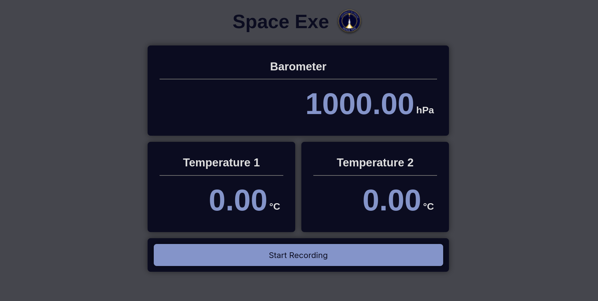

# Space Exe Rocket Firmware

Firmware for the Space Exe rocket, running on an **Arduino Nano ESP32**. It hosts a Wi-Fi AP and a web dashboard for live sensor data.

## Implemented

### Wi‑Fi access point + web server

The ESP32 runs as a soft AP (`Space-Exe-Rocket`) and serves a dashboard from **LittleFS** using [ESPAsyncWebServer](https://github.com/esp32async/ESPAsyncWebServer). Static assets live in `data/website/` and are uploaded to the filesystem partition.

### Live sensor dashboard

The dashboard displays:

- Barometer (hPa)
- Temperature 1 and 2 (°C), read from analog pins `A0` and `A1`

The values update in real time from a SSE connection. Currently none of these values work but they are a **proof of concept**.

### Recording toggle

A **Start / Stop Recording** button on the dashboard POSTs to `/toggle-recording`. The firmware flips a recording flag and broadcasts the new state over SSE so the button label stays correct.

### LittleFS

The web UI is stored on LittleFS rather than embedded in flash. Flight data will also be logged to LittleFS — this matters because LittleFS is designed for embedded flash: if power is lost mid-flight, data written up to that point should remain intact.

## Planned

**Foundations**

- **Implement real sensor data** — read the actual sensor data from the hardware
- **Flight data logging** — log flight data to LittleFS, including pressure, temperature, and altitude

**Pre-launch**

- **Wi‑Fi off from dashboard** — disable the AP during flight to save power and reduce RF interference

**Post-landing recovery**

- **RGB apogee indicator** — flash the onboard RGB LED to encode the apogee digits (e.g. digit count via flashes, then each digit)
- **Auto Wi‑Fi on after landing** — automatically re-enable the AP once the rocket has landed
- **Apogee on dashboard** — compute and display peak altitude in the UI
- **Download flight data** — endpoint and dashboard control to download logged data to a laptop
